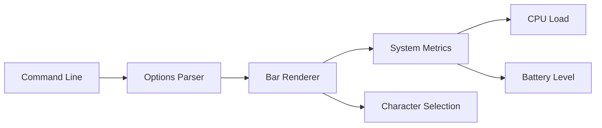

# sysinfo 🖥️

## Description 📝

This command-line utility displays system information in a compact, visual
format. It currently supports displaying CPU load and battery level (as a
percentage of fully charged) using Unicode bar characters. The tool is designed
for use in terminal environments, particularly in tmux status lines, where
compact visual feedback about system resources is valuable.

## Features ✨

- **Compact Visual Representation**: Displays system metrics using Unicode bar
  characters (like ▋or ▅)
- **Dual Display Modes**: Supports both horizontal and vertical bar
  orientations
- **Multiple Metrics**: Can display CPU load or battery level
- **Customizable Output**: Flexible formatting options for integration into
  terminal environments
- **Cross-Platform**: CPU load support on all platforms, battery support on
  macOS
- **Terminal Integration**: Optimized for use in tmux and other terminal
  multiplexers

## Architecture Overview 🏗️

The sysinfo utility follows a clean, modular architecture with clear separation of concerns:

### Core Components 🧩

**Bar Renderer** (`Bar`)
- Handles the visual representation of system metrics
- Manages Unicode character mapping for different bar orientations
- Implements measurement calculation logic for CPU load and battery percentage

**System Metrics Provider** (`cpuLoad`, `batteryFull`)
- Fetches real-time system information
- Handles platform-specific implementation details
- Provides normalized values for consistent bar rendering

**Configuration Manager** (`Options`)
- Centralized flag parsing and configuration handling
- Supports command-line argument validation
- Manages display formatting and output customization

### Component Interactions 🔄



The system starts with command-line argument parsing, which creates an
`Options` struct. This object is passed to the `Bar` renderer, which fetches
the appropriate system metrics and displays them using Unicode characters.

### Loading Mechanism 📥

The utility follows a straightforward loading pattern:
1. Parse command-line flags into `Options` struct
2. Create `Bar` instance with provided options
3. Calculate system metrics based on mode (CPU or battery)
4. Render visual representation using Unicode characters

### Command-Line Interface 🖥️

The utility supports various flags for customization:

```bash
# Basic usage - displays CPU load
sysinfo

# Display battery level
sysinfo -mode battery

# Horizontal bar display
sysinfo -horizontal

# Custom formatting
sysinfo -format "CPU: %s "

# Specify processor count for CPU calculations
sysinfo -processor-count 8

# Specify battery percentage directly (useful for testing)
sysinfo -battery-percentage 75
```

## Installation 📦

Use go to install the command:

```bash
go install github.com/flori/sysinfo/cmd/sysinfo@latest
```

## Examples 🎯

### Basic Usage

```bash
# Display CPU load as a vertical bar
sysinfo
# Output: ▄

# Display battery level
sysinfo -mode battery
# Output: █

# Horizontal bar display
sysinfo -horizontal
# Output: ▋

# Integration with tmux
set -g status-right "… #[reverse]#(sysinfo -mode cpu -format ' 🖥  %%s')#(sysinfo -mode battery -format ' 🔋 %%s')"
```

### Advanced Usage

```bash
# Custom formatting with prefix
sysinfo -mode battery -format "Battery: %s "

# Multiple displays in tmux
sysinfo -mode cpu -format "CPU: %s " -horizontal
sysinfo -mode battery -format "BAT: %s "
```

## Integration Examples 🧩

### tmux Integration

The utility is designed for terminal multiplexers like tmux. Here's a complete tmux configuration example:

```bash
# In your .tmux.conf
set -g status-right "… #[reverse]#(sysinfo -mode cpu -format ' 🖥  %%s')#(sysinfo -mode battery -format ' 🔋 %%s')"
```

This creates a status line showing both CPU load and battery level with appropriate icons.

## Error Handling ⚠️

The utility handles errors gracefully:
- Invalid mode flags result in usage information
- System metric fetching errors are logged and displayed as empty bars
- Command-line argument validation prevents malformed inputs

## Performance Considerations ⚡

- Minimal system overhead - only fetches necessary metrics
- Efficient Unicode character rendering
- Fast execution suitable for terminal integration
- No external dependencies beyond standard system utilities

## Platform Support 🌍

### CPU Load
- Supported on all platforms that have the `ps` command available
- Cross-platform compatibility for CPU monitoring

### Battery Level
- Native support for macOS using `pmset` and `perl` commands
- Other platforms require manual specification via `-battery-percentage` flag
- Placeholder support for future platform-specific implementations

### Verification Commands

```bash
# Test basic functionality
sysinfo -h

# Test CPU load fetching
sysinfo -mode cpu

# Test battery level fetching (macOS only)
sysinfo -mode battery
```

## Configuration ⚙️

The utility supports configuration through command-line flags:

| Flag | Description | Default |
|------|-------------|---------|
| `-mode` | Operation mode (cpu/battery) | cpu |
| `-horizontal` | Display horizontal bars | false |
| `-processor-count` | Number of processors | auto-detect |
| `-battery-percentage` | Direct battery percentage | auto-detect |
| `-format` | Output format string | "" |
| `-load` | Direct load average | auto-detect |

## Author 👨‍💻

Florian Frank <mailto:flori@ping.de>

## License 📄

Apache License, Version 2.0

See the [LICENSE](cmd/sysinfo/LICENSE) file in the repository for full license
text.

