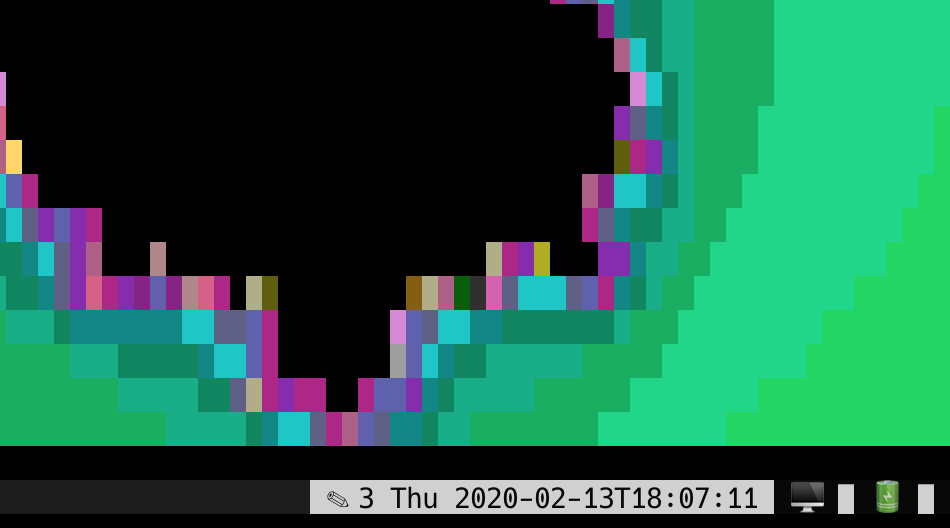

# sysinfo

## Description

This library display system information, so far cpu load average and
battery level (as a percentage of fully charged) in a small form factor.

## Installation

Use go to install the command:

```
# go get -u github.com/flori/sysinfo/cmd/sysinfo
```

## Examples

$ sysinfo

displays the cpu load as a small bar graph like `▄`. See `sysinfo -h` to tweak the output.

$ sysinfo -mode battery

displays the battery level instead. Only mac is supported directly, otherwise you have to use
the -battery-percentage argument).

Boring? Use this in your tmux configuration:
```
set -g status-right "… #[reverse]#(sysinfo -mode cpu -format ' 🖥  %%s')#(sysinfo -mode battery -format ' 🔋 %%s')"

```
You can keep an eye on these important values now:




## Author

Florian Frank mailto:flori@ping.de

## License

Apache License, Version 2.0 – See the COPYING file in the source archive.
